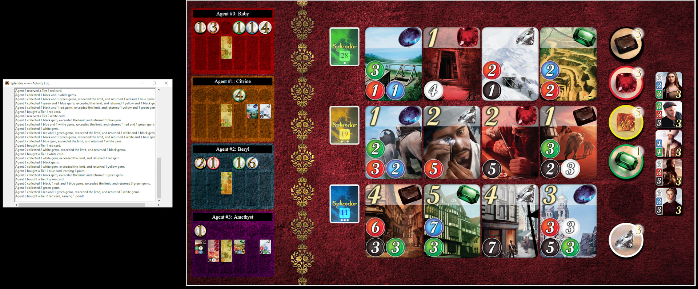

# Splendor Project Template

The purpose of this project is to implement a Splendor Autonomous Agent that can play and compete in the UoM COMP90054-2024 _Splendor tournament_:

 
 
    
 

 
 **Please carefully read the rules of the [Splendor game](https://cdn.1j1ju.com/medias/7f/91/ba-splendor-rulebook.pdf)**. Splendor can be understood as a sequential decision problem about resource management. Understanding it well and designing a controller for it is part of the expectations for this project. 
 

## Task
 
**Task** is to develop an autonomous Splendor agent team to play the **Splendor Contest** by suitably modifying file [`agents/<t_XXX>/myTeam.py`](agents/t_XXX/myTeam.py) (please replace "XXX" in "<t_XXX>" with your own Canvas Teams ID and there maybe some other auxiliarly files you may implement). For example, if your team's Canvas Teams Name is "Canvas Teams 1", then you should change your folder from `agents/t_XXX/` to `agents/t_001/`. The code submitted should aim to be commented at high standards, be error-free, and _never crash_. 

In your solution, you have to use at **least 3 AI-related techniques** (**2 techniques at least for groups of 2**, but it is highly not recommended.) that have been discussed in the subject or explored by you independently, and you can combine them in any form. **We won't accept a final submission with less than 3 (or 2 depends on your final group size) techniques**. Some candidate techniques that you may consider are:

1. Blind or Heuristic Search Algorithms (using general or Splendor specific heuristic functions).
2. Classical Planning (PDDL and calling a classical planner).
3. Policy iteration or Value Iteration (Model-Based MDP).
4. Monte Carlo Tree Search or UCT (Model-Free MDP).
5. Reinforcement Learning – classical, approximate or deep Q-learning (Model-Free MDP).
6. Goal Recognition techniques (to infer intentions of opponents).
7. Game Theoretic Methods.

We recommend you to start by using search algorithms, given that you already implemented their code in the first project. You can always use hand coded decision trees to express behaviour specific to Splendor, but they won't count as a required technique. You are allowed to express domain knowledge, but remember that we are interested in "autonomy", and hence using techniques that generalise well. The 7 techniques mentioned above can cope with different games much easier than any decision tree (if-else rules). If you decide to compute a policy, you can save it into a file and load it at the beginning of the game, as you have 15 seconds before every game to perform any pre-computation. 

 
### Important basic rules 

When submitting a solution, please make absolutely sure you adhere to the following rules:

* Your code **must run _error-free_ on Python 3.8+**. Staff will not debug/fix any code. If your code crashes in any execution, it will not have any valid results from the online server. To ensure your code is error-free, you can test with docker locally (following this [link](docker/README.md))
* You can install Python 3.8 from the [official site](https://www.python.org/dev/peps/pep-0494/), or set up a [Conda environment](https://www.freecodecamp.org/news/why-you-need-python-environments-and-how-to-manage-them-with-conda-85f155f4353c/) or an environment with [PIP+virtualenv](https://uoa-eresearch.github.io/eresearch-cookbook/recipe/2014/11/26/python-virtual-env/).

* Your code **must not contain any personal information**, like your student number or your name. That info should go in the [TEAM.md](TEAM.md) file, as per instructions below. If you use an IDE that inserts your name, student number, or username, you should disable that.

* You are **not to change or affect (e.g., redirect) the standard output or error channels** (`sys.stdout` and `sys.stderr`) beyond just printing on standard output, including `logging`. If your file mentions any of them it will be breaking the "fair play" of the course (see below). These are used to report each game output and errors, and they should not be altered as you will be interfering negatively with the contest and with the other team's printouts. 

* Being a group assignment, you must **use your project Github** repository and GitHub team to collaborate among the members. The group will have write access to the same repository, and also be members of a GitHub team, where members can, and are expected to, engage in discussions and collaboration. Refer to the marking criteria below. 
